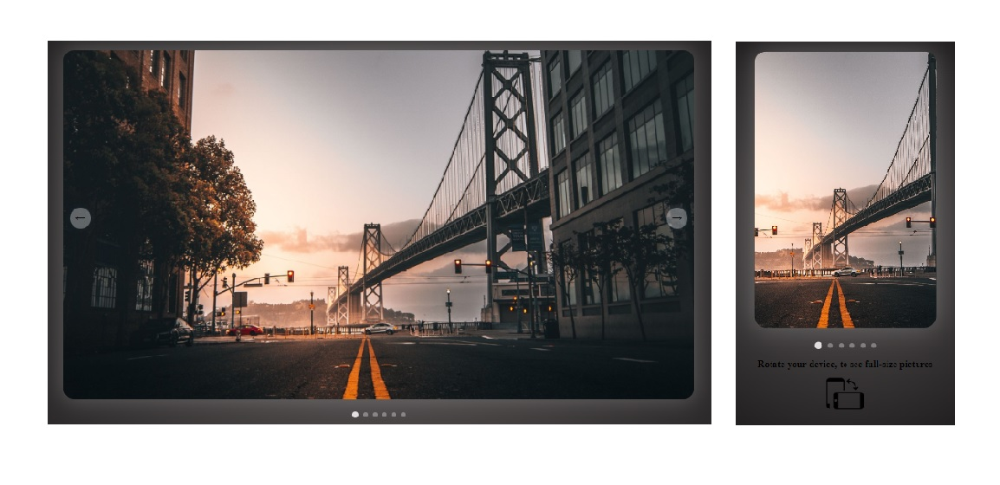

# Slide-Swipe-gallery

[Demo-link](https://pavelbichukov.github.io/Slide-Swipe-gallery/)

 

## Description
This project is a *simple slide gallery* of images, my practice in learning JS
 
 
## Functional
- changing images by pressing arrow buttons
- changing images by swipe on mobile devices

 
 
## Stack:

 
 

